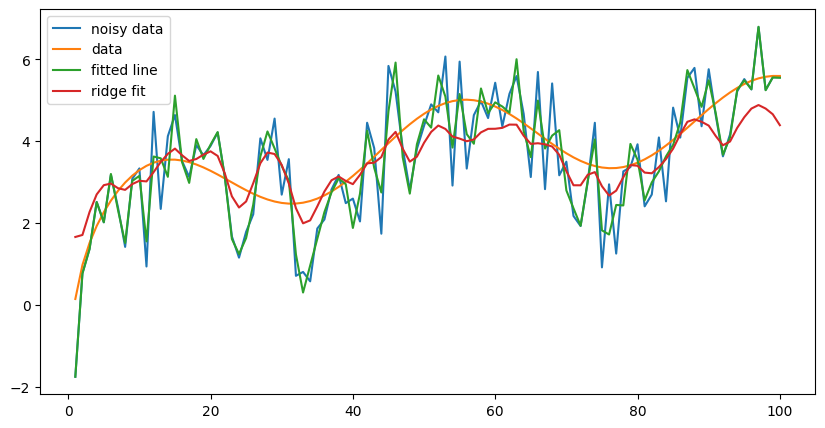

# This repo is for all my statistics, modeling and forecastings projects

## General
Random stuff goes here
* Splines explains how B splines can be used for curve fitting using linear models

* Hypothesis testing. Basic hypothesis testing using python. This is a quick project that I did in order to do some basic hypothesis testing. The data set is a list of hotel bookings with a variety of different features. We try to make conclusions about the relationships amongst the different features. For example, can the booking lead time be used to estimate the likelihood of cancelation?  Original dataset: https://www.kaggle.com/datasets/ahsan81/hotel-reservations-classification-dataset

## Python Algorithm Implementations
In this section I try to implement my own versions of popular forecasting algorithms. Needless to say, they are not designed to be highly efficient or effective, but to illustrate the underlying principles.

## Forecasting project:
This was my first ever experience with time series forecasting.
I dowloaded the data from the NOAA website, cleaned it and then used a number of methods to forecast the temperature.
You don't need to download the data yourself, you can simply use the data in the folder.

