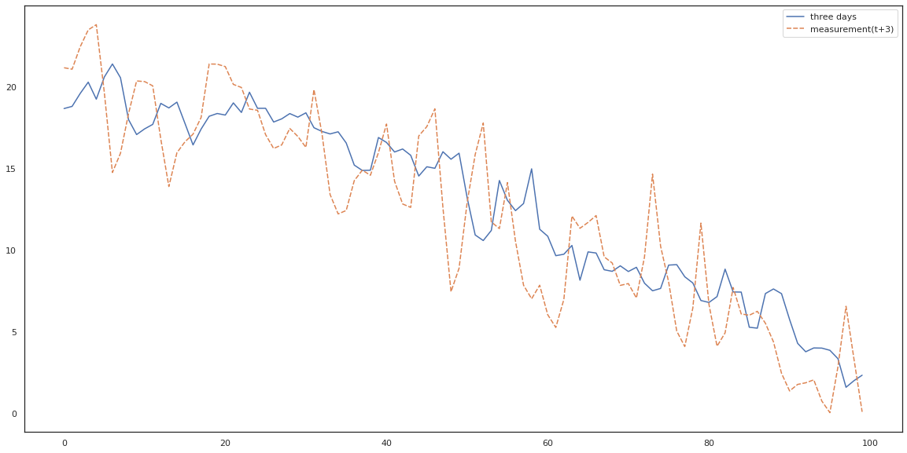

# This repo is for all my time series projects

## Forecasting project:
This was my first experience with time series forecasting.
I dowloaded the data from the NOAA website, cleaned it and then used a number of methods to forecast the temperature.
You don't need to download the data yourself, you can simply use the data in the folder.

## Python Algorithm Implementations
In this section I try to implement my own versions of popular forecasting algorithms. Needless to say, they are not designed to be highly efficient or effective, but to illustrate the underlying principles.
